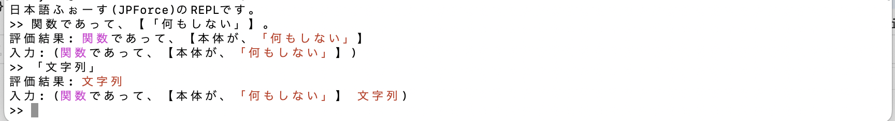
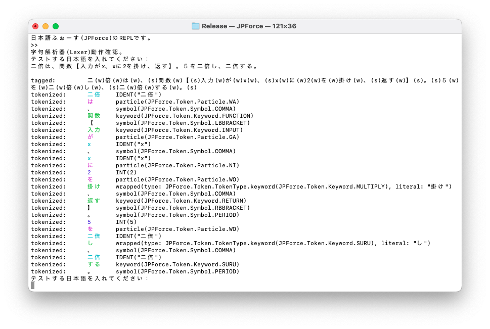

# 日本語ふぉーす(JpForce)

- [言語の説明](#言語の説明)
- [文法・言語仕様](./ProgrammingLanguageGuide.md)(別ドキュメント)
- [仮想マシンの仕様](./VirtualMachineSpecification.md)(別ドキュメント)
- [コマンド(REPL)](#インタープリタコンパイラjpforce-コマンド)

## 言語の説明

### 概要

日本語ふぉーす(JpForce)は、日本語の仕様書やコメントに近い形でプログラムを記述できることを目標としたプログラミング言語です。

本言語は、商用を目的としたものでは無く、実験的な仕様・実装です。参考にしていただければ幸いです。

### 目的

従来のプログラミング言語は、英数字や記号を中心に記述します。  
そのため理解を助けるためにコメントを多用しますが、コードとコメントの意味が乖離しやすく、可読性や保守性を損なう場合があります。

日本語ふぉーす(JpForce)では、日本語に近い記法で記述することで、コメントに頼らず理解しやすいプログラムを書くことを可能にします。

### 背景

日本語ふぉーすは、プログラミング言語 **Forth** の思想に着想を得ています。  
Forth は軽量で移植性が高く、シンプルな構造を持つ言語です。  
その思想を取り入れ、日本語でも直感的に扱える言語を目指して設計しました。

「日本語ふぉーす」という名称もここに由来しており、  
英語表記の "Force" には「力」や「無理やり」といったニュアンスを込めています。

### 特徴

ふぉーすは、従来の日本語プログラミング言語と同様に、逆ポーランド記法、スタックなどの手法により、日本語らしい表現を可能としています。
一方、SwiftやRubyといった現代的なオブジェクト言語に近い仕様を取り入れています。

これにより、既存言語に慣れたプログラマにも理解しやすく、既存のサンプルコードや設計パターンを日本語に翻訳するように記述でき、移植や学習コストの観点でも有用です。

#### 逆ポーランド記法

逆ポーランド記法とは、数式やプログラム記法の一種で、一般的なプログラミング言語とは異なり、演算子を被演算子の後方に記述します。
例えば、一般的なプログラミング言語の記法では、

```swift
print(3 + 4)
```

の様な順に記述しますが、ふぉーすでは、

```
3と4を足し、表示する。
```

の様に、逆ポーランド記法で記述することにより、日本語の語順でプログラムを表現できます。

#### スタック

プログラムを実行する際、定義された識別子や引数を、一旦「スタック」というメモリ領域に格納し、述語で(格納した順とは逆順に)取り出し、演算等を行います。

_例：_

```
4から1を引く。
```

上記では、４、１の順にスタックに格納し、`引く`で１、４の順に取り出し演算を行います。

ただし、ふぉーすでは関数等で定義した順に、入力の識別子にスタックの引数を割り当てる機構があるため、スタックの順を意識してプログラミングを行う必要はありません。

#### 助詞

日本語は、述語(動詞、形容詞、名詞）を中心に構成され、述語と他の成分は、格助詞「を、に、まで、が、より、から、で、へ、と」で関係づけられています。  
また、助詞「は」は、主題とその説明を関係付け、格助詞「の」は、名詞と名詞をつなぐ働きがあり、つながれた名詞全体で 1 つの成分となります。

ふぉーすでは、これらの助詞や格助詞を区切り文字として識別し、文中の成分(単語)を識別します。  
一般的なプログラミング言語では、助詞ではなく、スペース(空白)や記号を区切り文字としていますが、これを採用すると、日本語として違和感があるため、この様な機構を採用しています。

#### 定義

一般的な言語では、変数、関数、クラスを表すキーワードを付けた識別子に対して定義します。

```swift
var a = 1       // 変数 a に初期値 1 を定義
func f() {…}    // 関数 f を定義
class c {…}     // クラス c を定義
```

ふぉーすでは、助詞`は`を使って次の様に定義します。

```
aは、1
fは、関数であって、…
cは、型であって、…
```

助詞`は`によって、主題(識別子)に対応する説明(定義)を関連付けるという、日本語の構造に沿った定義法になります。

#### 連用形

プログラムは、複数の述語(命令）を並べて順次実行することがありますが、一連の動作などは、述語が１つである単文を並べるのでなく、複文で記述する方が読みやすくすることが可能です。  
日本語で複文を記述する場合、文末以外の述語は、語尾が連用形に変化します。

_例：_

```
aをbで割り、cを掛ける。
```

この例では、終止形「割る」が連用形の「割り」と変化しています。
ふぉーすでは、「連用形」→「終止形」の辞書を持っており、「割り」を「割る」と同じものとして処理することにより、日本語的な表記を可能としています。

#### 記号

一般的なプログラミング言語は、数式をベースにしており、簡潔さのため、記号を多様する傾向がある様に思います。

_例：_

```swift
let b = a.x ? c : d   // a の x が true なら c、false なら d、を b に代入する。
```

これは、数式に関するプログラミングには適しており、慣れれば分かりやすいですが、多用すると理解する上で問題になったり、あとで分からなくなったりする原因となる場合があります。  
ふぉーすでは、記号の多用を避け、日本語文に用いる記号を採用し、読み易さ(聞き易さ)と、理解し易さを優先しています。

以下は、上記をふぉーすで表記した場合の例です。

_例：_

```
bは、aのxによって、cかd。
(もしくは)
bは、aのxが真であるかによって、cかd。
```

記号に頼らず、文章的にすることより、プログラムを音声により読み上げても、意味を把握しやすくなっています。

### 表記・表現方法

ふぉーすは「プログラムを日本語の文章やコメントのように書ける」ことを目指しつつ、一般的なプログラミング言語と同等の表現力を持てる様にしています。

そのため、ふぉーすの文法は自然な日本語らしさと、プログラミング言語としての機能性の両立を意識しています。

これを実現するために、以下のような表記上の特徴を持たせています。

#### キーワード表記の方針

プログラミングで使用するキーワード(予約語)は、独自造語ではなく、解説書や参考書で一般的に使われる日本語訳を採用しています。  

_例:_

- string → 文字列
- func → 関数
- true → 真
- protocol → 規約
- range → 範囲

#### 表現のバリエーション

ふぉーすでは、同じ意味のプログラムを、日本語らしい文章として書くことも、既存言語に近い簡潔な形で書くこともできます。

_例:_

```
甲は、関数であって、入力が〜
甲は、関数であり、入力が〜
甲は、関数で【入力が〜】
甲は、関数【入力が〜】
```

このように複数の表現を許容することで、場面に応じて「文章としての読みやすさ」と「プログラムとしての簡潔さ」を選べるようにしています。

#### 構造表現（ブロック）

制御文や関数定義など、複数文を含む構造は隅付き括弧 `【】`で表します(括弧内をブロックと呼ぶ)。  
ブロックが一行で収まる場合は、`【】`を省略可能で、ブロック内のインデント、空白、改行は自由です。

例えば、1 から 12 までのフィボナッチ数を表示する場合、以下の様な記述が可能です。

```
フィボナッチ数は、関数であって、【入力が数字「数値」であり、本体が、
    数字が、
    １の場合、１を返す。
    ２の場合、２を返す。
    それ以外は、
        数字から1を引き、フィボナッチ数を実行したものと、
        数字から2を引き、フィボナッチ数を実行したものを、足す。
】。
1から12まで反復【入力が数で、数でフィボナッチ数を実行し、表示する】。
```

## 仕様

仕様・言語の使い方については、[「文法」](./ProgrammingLanguageGuide.md)に記載しています。  
仮想マシン(VM)の仕様について、「[仮想マシンの仕様](VirtualMachineSpecification.md)」に記載しています。

## 参考文献

- [Go 言語でつくるインタプリタ](https://www.oreilly.co.jp/books/9784873118222/)

  - Thorsten Ball 　著、設樂 洋爾　訳
  - オライリー・ジャパン (オーム社)
  - ISBN 978-4-87311-822-2

  JPForce コマンドは、この本の内容がベースになっています。この本が無ければここまでできていません。

- [Writing A Compiler In Go](https://compilerbook.com/)

  - Thorsten Ball

  この本をベースにコンパイラを実装しています。

- [日本人のための日本語文法入門](https://bookclub.kodansha.co.jp/product?item=0000210659)

  - 著：原沢　伊都夫
  - 講談社現代新書
  - ISBN 978-4-06-288173-9

  特に助詞の使い方・意味を参考にしています。

- [Swift 実践入門](https://gihyo.jp/book/2020/978-4-297-11213-4)

  - 石川洋資，西山勇世　著
  - 技術評論社
  - ISBN 978-4-297-11213-4

  Swift は、開発言語であり、開発はもちろん、ふぉーす文法の参考にしています。

- [IT 用語辞典 e-Words](https://e-words.jp/)  
  コンピュータ用語や、対応する英語などの参考にしています。

## インタープリタ/コンパイラ(JPForce コマンド)

言語の仕様を検証するために、Swift で作成した CLI インタープリタ/コンパイラ`JPForce`を用意しています。

当コマンドは、本言語の仕様や表記方法を検証するために作成した試験的な実装です。  
そのため、配布や商用利用を想定したものではなく、PoC (Proof of Concept) としての位置づけになります。

### ビルド

リポジトリーをコピーし、xcode でコンパイルします。

### 開発/実行環境(2025 年 9 月 現在)

- Swift: Swift 6.2
- xcode: Version 26.0.1
- MacOS: Tahoe 26.0

### 実行

#### REPL の起動

ビルドされた`JPForce`コマンドを実行することにより、以下の様に REPL(Read-Eval-Print Loop)が起動し、プロンプト`>>`が表示されます。

_ターミナルのイメージ_

```console
% ./JPForce
日本語ふぉーす(JPForce)のREPLです。
>>
```

ここに、プログラムを記述し改行することにより、一行ごとにプログラムが実行されます。

(REPL には、字句解析の確認を行うモード([字句解析器](#字句解析器lexer)参照)と、翻訳・実行を行う VM モード([翻訳器と仮想マシン](#翻訳器compilerと仮想マシンvm)参照)があります。)

複数行のプログラムを実行するには、まず、ファイルにテキストでプログラムを記述し、「書類」フォルダーに保存します。  
次に、プロンプトに`ファイル「<ファイル名>」を実行する。`を入力することにより、プログラムが実行されます。

REPL を終了するには、`Control + D`を入力します。

注：xcode 上で、REPL を起動した場合、プロンプトの後に日本語を直接入力することはできません。`Control + F`で、検索を開いて、そこに入力した日本語をコピペするか、メモ帳等で書いてコピペする必要があります。

[「文法」](./ProgrammingLanguageGuide.md)に記載している例も、基本的にコピペで、実行できる様にしています。  
(スタックは、誤動作の原因にもなるので、不要であれば、空にしてから実行することをお勧めします。)

#### REPL の実行結果の見方

REPLでは、プログラムは以下の様に実行され結果が表示されます。

1. 字句解析器(Lexer)が、プログラムをトークン(Token)に分解します。  
1. 構文解析器(Parser)が、トークンから構文木(AST: Abstract Syntax Tree)を構成します。  
1. 評価器(Evaluator)が、構文木を辿って、評価・実行します。

この実行結果の表示について、以下説明します。

##### 表示色

関数・算出・型・規約などは、定義文で評価される際に、一部(本体部)が、構文木として辞書に登録されます。  
このため、述語`表示`によって、識別子を表示すると構文木を再構築されたものが、文字列として表示され、同時にトークンの属性によって、色分けされます。(トークンの色分けについては、[解析結果の見方](#解析結果の見方)を参照。)

注１：`関数`、`数値`などのオブジェクトの型および、`真`、`偽`、`無`などのリテラルは、マゼンタで色表示します。  
注２：表示色は、Release バージョンのみです。(xcode 上でも表示されません。表示色はエスケープ文字で実現しており、xcode で Release バージョンを起動した場合、色の代わりに`[31m`等のエスケープ文字が表示されます。)

##### 評価結果

プログラムを実行した結果、すなわち、プログラムが最終的に返した値を`評価結果：`として表示します。ただし、定義文等、値を返さない場合は、`評価結果`は表示されません。

##### エラー表示

字句解析時にエラーを検出した場合は、以下の様な形式でエラーを表示します。

```
形式：字句解析エラー： <エラーの内容>。
```

例えば、文字列の閉じ括弧`」`を入力し忘れた場合、以下の様に表示されます。

```
>> 関数であって、【「何もしない】
字句解析エラー： 」が見つからない。
構文解析器が、4個のエラーを検出した。
	式の解析で、「ILLEGAL("」が見つからない")」に対応する構文解析方法が実装されていない。
	式文で、式の解析に失敗した。
	ブロック(【】)内で文の解析に失敗した。
	式文で、式の解析に失敗した。
>>
```

注： 字句解析器は、トークンにエラーを出力するので、それを受けて構文解析器もエラーを表示します。

また、構文解析時にエラーを検出した場合は、以下の様な形式でエラーを表示します。

```console
形式：構文解析器が、<n>個のエラーを検出した。
　　　<各エラーの詳細>(解析位置：<現トークンの文字>)
```

例えば、範囲の指定を誤った場合、以下の様に表示されます。

```
日本語ふぉーす(JPForce)のREPLです。
>> 甲は、範囲【１から２以上】。
構文解析器が、3個のエラーを検出した。
	範囲で、範囲式の解析に失敗した。(下限「から」が重複)(解析位置: 】)
	式文で、式の解析に失敗した。(解析位置: 】)
	定義文「<識別子>は、<式(値)>。」で、式の解釈に失敗した。(解析位置: 】)
>>
```

`解析位置`とは、解析エラーが発生した際のトークンを示しています。上記の例では、`】`の前まで、解析しエラーを検出したことを意味します。

構文エラーは、構文解析器が AST を辿っているため、エラーが検出箇所から、木の上方へと伝搬します。  
上記例では、`範囲`の解析でエラーを検出し、その上位の式文`範囲【１から２以上】`、さらに、定義文`甲は、範囲【１から２以上】。`の解析のエラーが伝わっています。

注：「式文」とは、複数の式からなる文のことです。

##### スタック表示

プログラムがスタックに格納した値を、`入力： (<スタックの値>)`として表示します。スタックは、古い順にスペースで区切られ表示されます。

スタックは、プログラム終了まで、自動的に削除されることはありません。  
スタック内容が不要である場合は、述語`空`で削除してください。  
(`空`と入力するより、`空にする`と入力した方が変換が早いです。)

```console
日本語ふぉーす(JPForce)のREPLです。
>> 1と2を
評価結果: 2を
入力: (1と 2を)
>> 空にする
入力: ()
>>
```

注：評価結果、およびスタックに表示される文字列(STRING)には、かぎ括弧`「」`が付きません。ただし、`関数`等の本体、すなわち、AST から再構築された文字列には、かぎ括弧`「」`が表示されます。



#### サンプルプログラム

本ドキュメントや文法書にあるサンプル等をまとめたファイル「[サンプル.txt](./サンプル.txt)」を用意しています。

書類フォルダーにファイルを置き、サンプル.txt の一行目にあるとおり、`ファイル「サンプル.txt」を実行`し、コンソールにコメント記号`※`のある行のプログラムをコピペすることにより、動作が確認できます。

#### 字句解析器(Lexer)

REPL のプロンプト`>>`で`改行`することにより、字句解析器(Lexer)が起動します。

```console
日本語ふぉーす(JPForce)のREPLです。
>>
字句解析器(Lexer)動作確認。
テストする日本語を入れてください：

```

ここに、プログラムや文章を入力することにより、解析結果が表示されます。

字句解析器を終了するには、`Control + D`を入力します。

注：コマンドが終了します。REPL には戻りません。

##### 解析結果の見方

入力した文字列の下に`tagged:`と書かれた行が表示されます。  
これは、字句解析器が文字列をトークンに分解する前に、文字列を語`(w)`と記号`(s)`に分解し、それぞれにタグ付けしたものです。`tagged:`の後ろは、分解・タグ付けされた文字列を表示しています。

次に、`tokenized:`と書かれた行が続きます。  
これは、トークンに分解された文字列と、その属性を表しています。また、トークンは属性によって、色分けされています。



トークンの属性(TokenType)は、以下の通りです。

1. `IDENT` (シアン)：
   識別子。
1. `INT` (青)：
   数値。
1. `STRING` (赤)：
   文字列。
1. `symbol` (無し)：
   記号。
1. `keyword` (緑)：
   予約語。
1. `particle` (マゼンタ)：
   助詞。
1. `wrapped` (色は属性による)：
   識別子、予約語、または助詞の連用形。

注：予約語、助詞、記号の括弧内は、token.swift 内の列挙子です。

#### 翻訳器(Compiler)と仮想マシン(VM)

ふぉーすのプログラムをバイトコードに翻訳(コンパイル)し、仮想マシンで実行する環境を提供します。  
(注：コンパイラについては、仕様の一部未実装の部分があります。)

##### モード切り替え

プロンプトに続いて`vm`を打つことにより、仮想マシン・モードに切り替わります。  
インタープリタ・モードに切り替えるには、`interpriter`を入力します。

```console
日本語ふぉーす(JPForce)のREPLです。
>> vm
仮想マシン・モード
>> interpriter
インタプリタ・モード
>>
```

注；仮想マシンとインタープリタは独立しており、スタックなど環境は両者で共有していません。

##### 翻訳と実行

仮想マシン・モードでは、インタープリタ・モードと同様にプログラムを記述し、改行することにより、プログラムが翻訳(コンパイル)され実行されます。

プログラムは、インタープリタと同様に、まず、字句解析器(Lexer)によって、トークン(Token)に分解されます。その後、構文解析器(Parser)によって、構文木(AST: Abstract Syntax Tree)を構成します。

そして、翻訳器(Compiler)によって、構文木がバイトコード(bytecode)に翻訳され、VM によってバイトコードが実行されます。

以下の様に、プロンプト`>> `にプログラムを入力すると、翻訳・実行され、結果を表示します。

_例：プログラムの翻訳・実行結果_

```console
>> xは1。xが1である場合【10】、それ以外は【20】。
翻訳結果：
0000 OpConstant 0	: 1(数値)
0003 OpSetGlobal 0	: x(識別子名)
0006 OpGetGlobal 0	: x(識別子名)
0009 OpPhrase 1		: が(格)
0011 OpConstant 1	: 1で(句)
0014 OpPredicate 32	: ある
0016 OpJumpNotTruthy 25
0019 OpConstant 2	: 10(数値)
0022 OpJump 28
0025 OpConstant 3	: 20(数値)

実行結果: 10
入力: (10)
>>
```

以下に、表示内容について説明します。

##### 翻訳・実行結果

###### 翻訳結果

翻訳の結果であるバイトコードは、逆アセンブル(disassemble)してを表示します。

命令語(オペコードとオペランド)の内容については、別途、サンプルプログラムとともに[仮想マシンの仕様](./VirtualMachineSpecification.md)に記載しています。

1. バイトコードのアドレス(番地)  
   バイトコードのアドレスは、４桁１０進数で表示されます。

2. オペコードとオペランド  
   アドレスの右側に表示されます。オペランドは１０新数で表示し、複数ある場合は、`,`(カンマ)で区切られます。

3. 補足  
   `:`以降は、命令語(主にオペランド)の補足になります。

- オペランドが、オブジェクトを指す場合、`値`と括弧内に`型`を表示します。
- `OpGetGlobal`の様に`識別子`にアクセスするものは識別子名を表示します。  
  ただし、局所変数にアクセスする`OpGetLocal`、`OpSetLocal`、`OpGetFree`については、逆アセンブル結果で、`??`と表示されます。  
  これは、関数翻訳時に、識別子をインデックスに変換するためのシンボルテーブルが一時的に生成されますが、コンパイル終了時には存在しないため、逆アセンブルで識別子を参照することができないためです。
- `OpPredicate`の場合、実行する`述語`を表示します。
- `OpPGetProperty`の場合、取得する`属性名`を表示します。
- `OpPhrase`の場合、`格`を表示します。

例えば、上記では、`0016`番地に`OpJumpNotTruthy`命令が記載されており、`真`でない場合、`0025`番地に分岐することを示します。

###### 翻訳済み関数

翻訳の結果、定数表に`翻訳済み関数`がある場合、バイトコードを逆アセンブルし、表示します。

以下に、`翻訳済み関数`がある例を示します。

_例：`翻訳済み関数`を含む表示例_

```console
>> newAdderは、関数【入力がaとb。関数【入力がc。aとbとcを足す】】。adderは、1と2で、newAdderを実行。8でadderを実行。
翻訳結果：
0000 OpClosure 1, 0	: 翻訳済み関数であって、【入力が、2個。本体が、04 00 04 01 20 00 00 02 17】(翻訳済み関数)
0004 OpSetGlobal 0	: newAdder(識別子名)
0007 OpConstant 2	: 1と(句)
0010 OpConstant 3	: 2で(句)
0013 OpGetGlobal 0	: newAdder(識別子名)
0016 OpCall
0017 OpSetGlobal 1	: adder(識別子名)
0020 OpConstant 4	: 8で(句)
0023 OpGetGlobal 1	: adder(識別子名)
0026 OpCall

翻訳済み関数(0)：
0000 OpGetFree 0	: ??(識別子名)
0002 OpPhrase 5		: と(格)
0004 OpGetFree 1	: ??(識別子名)
0006 OpPhrase 5		: と(格)
0008 OpGetLocal 0	: ??(識別子名)
0010 OpPhrase 2		: を(格)
0012 OpPredicate 24	: 足す
0014 OpReturn

翻訳済み関数(1)：
0000 OpGetLocal 0	: ??(識別子名)
0002 OpGetLocal 1	: ??(識別子名)
0004 OpClosure 0, 2	: 翻訳済み関数であって、【入力が、1個。本体が、21 00 06 05 21 01 06 05 04 00 06 02 18 24 17】(翻訳済み関数)
0008 OpReturn

実行結果: 11
入力: (11)
>>
```

最初の関数定義(`newAdder`)で、２つの関数を定義しています。  
上記の例では、外側の関数が`翻訳済み関数`(1)で、内側が`翻訳済み関数`(0)です。

###### 実行結果

バイトコードを仮想マシンで実行した結果は、インタープリタと同様に実行結果と入力(スタック)を表示します。  
ただし、実行結果は最新のスタックの値を表示しています。(スタックが前回と同じ場合、実行結果は表示されません。)

## 課題

- ブロック`【】`と EOL によるブロック終了処理(Parser)の仕様・設計があいまい。
- エラー検出をしていないため、エラーメッセージが分かりにく場合がある。
- 連用形辞書のメンテナンス機能がない
- 実行速度が遅い(コンパイラとインタープリタで速度に違いがない)

## テスト

xcode の XCTest (UnitTests) で、Token, AST, Object, Lexer, Parser, Evaluator 等の単体テストをしています。
(ベンチマークテストを UnitTests に追加してます。)

## ライセンス

[MIT](./LICENSE)
